# Sistema Operacional Pessoal (POS)

Painel de produtividade pessoal desenvolvido para a disciplina **Produtividade e
Gestão do Tempo**. É uma aplicação real e funcional (não um mockup): os dados são
persistidos no Airtable e as sugestões de IA são geradas de verdade pela API do
Google Gemini.

## Stack e ferramentas

- **Next.js 15** (App Router) + **TypeScript**
- **Tailwind CSS 4**
- **Airtable REST API** — camada de dados, via `fetch` nativo (sem SDK)
- **Google Gemini API** — camada de IA, via `fetch` nativo (sem SDK)
- **Vercel** — deploy
- **Claude Code** — usado para construir o projeto a partir de um plano de
  execução em fases, com autonomia assistida

## Métodos de produtividade aplicados

- **GTD (Getting Things Done)** — captura de tarefas no Kanban, organizadas por
  status (A Fazer / Em Andamento / Concluído)
- **Matriz de Eisenhower** — priorização em 4 quadrantes (urgente/importante),
  com sugestão automática via IA
- **Princípio de Pareto** — o quadrante Q1 evidencia os poucos itens de maior
  impacto que merecem atenção imediata
- **Técnica Pomodoro** — ciclos de 25 min de foco / 5 min de pausa com timer
  visual

## Como a IA é usada

Três funcionalidades reais, integradas ao Google Gemini (`gemini-3.6-flash`),
sempre chamadas do servidor (a chave nunca é exposta ao client):

1. **Sugerir prioridade** (`/api/ai/suggest-quadrant`) — no formulário de nova
   tarefa do Kanban, o botão "IA: sugerir prioridade" envia título e notas para
   o Gemini, que classifica a tarefa em Q1–Q4 da Matriz de Eisenhower com uma
   justificativa curta.
   _Exemplo: "Entregar relatório final amanhã de manhã" → **Q1**, "urgente
   devido ao prazo e importante por ser uma entrega acadêmica final."_

2. **Desdobrar tarefa** (`/api/ai/breakdown-task`) — em cada card do Kanban, o
   botão "IA: desdobrar tarefa" aplica o método EDA (Esclarecer → Desdobrar →
   Agir) e retorna de 4 a 6 subtarefas executáveis, com opção de criá-las como
   novas tarefas.

3. **Resumo semanal** (`/api/ai/weekly-summary`) — no Dashboard, o botão
   "Gerar resumo da semana" agrega os dados de Tasks, Habits e Metrics dos
   últimos 7 dias e pede ao Gemini um resumo do desempenho com sugestões de
   prioridades para a semana seguinte.

Todo resultado gerado é salvo na tabela `AIInsights` do Airtable e pode ser
consultado no card **Histórico de IA**, na parte inferior do painel — a prova
visual de que a IA está sendo usada de verdade, e não apenas simulada.

## Fluxo de organização

```
Captura (Kanban)
   → Priorização com IA (Eisenhower)
      → Planejamento semanal (grade de 7 dias)
         → Gestão de compromissos (agenda cronológica)
            → Execução com Pomodoro
               → Revisão de hábitos e métricas
                  → Resumo semanal com IA
```

## Como rodar localmente

1. Copie `.env.example` para `.env.local` e preencha as três chaves:
   ```
   AIRTABLE_TOKEN=
   AIRTABLE_BASE_ID=
   GEMINI_API_KEY=
   ```
2. Instale as dependências:
   ```
   npm install
   ```
3. Rode o servidor de desenvolvimento:
   ```
   npm run dev
   ```
4. Acesse `http://localhost:3000`.

## Como usar a solução

- **Kanban**: crie tarefas com título e notas; use "IA: sugerir prioridade"
  antes de salvar para já classificá-las na Matriz de Eisenhower; arraste os
  cards entre colunas para mudar o status; use "IA: desdobrar tarefa" para
  quebrar uma tarefa grande em passos executáveis.
- **Planejamento Semanal**: visualize blocos de Foco, Reunião, Admin e
  Descanso distribuídos nos 7 dias da semana.
- **Compromissos**: acompanhe a agenda cronológica de reuniões, entregas e
  compromissos pessoais.
- **Matriz de Eisenhower**: veja as tarefas já classificadas agrupadas pelos 4
  quadrantes.
- **Pomodoro**: use o timer para ciclos de foco e pausa.
- **Hábitos**: marque diariamente os hábitos cumpridos e acompanhe o streak.
- **Protocolo de Comunicação**: consulte as regras adotadas para e-mail, chat,
  reuniões e foco profundo.
- **Dashboard**: acompanhe as métricas da semana e gere o resumo semanal com
  IA.
- **Histórico de IA**: revise as últimas sugestões, desdobramentos e resumos
  gerados pelo Gemini.
- Alterne entre tema claro e escuro pelo botão no cabeçalho.

## Prints

> Screenshots tiradas do site publicado na Vercel (não do localhost).

**Visão geral do painel**
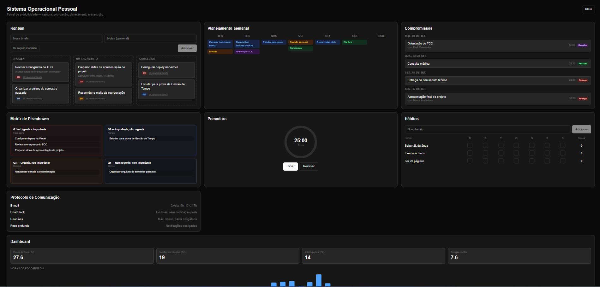

**Kanban**
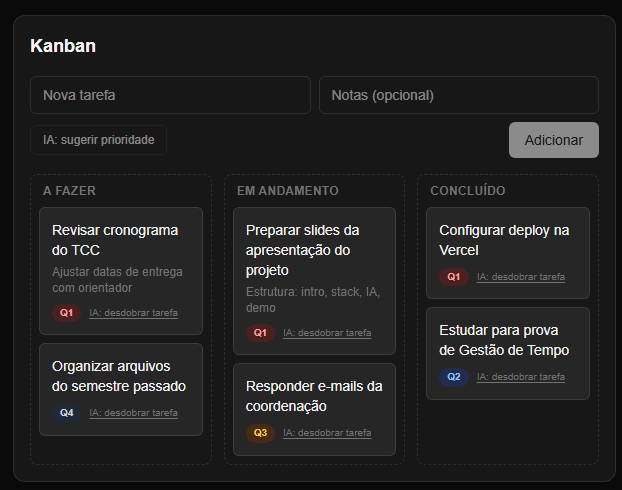

**Sugestão de prioridade da IA**
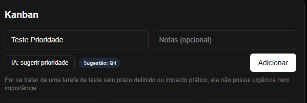

**Desdobramento de tarefa com IA (método EDA)**
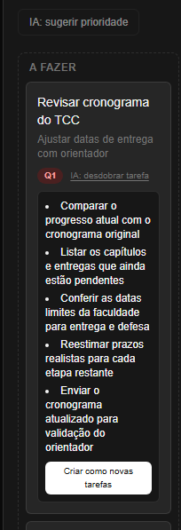

**Planejamento Semanal**
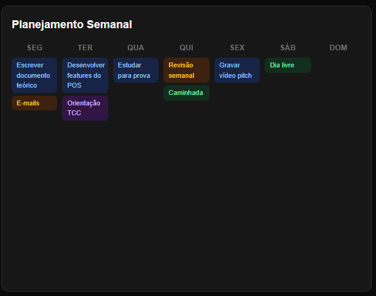

**Compromissos**
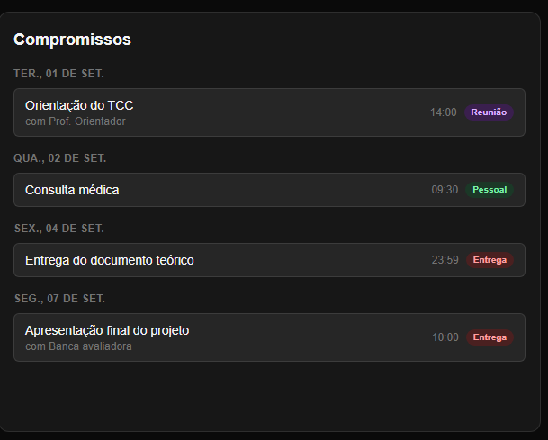

**Matriz de Eisenhower**
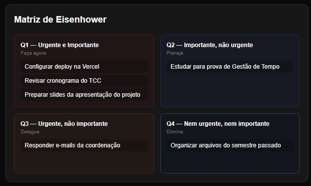

**Pomodoro**
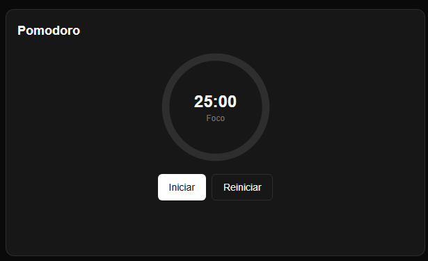

**Hábitos**
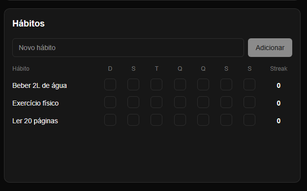

**Protocolo de Comunicação**
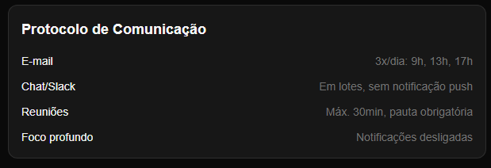

**Dashboard**
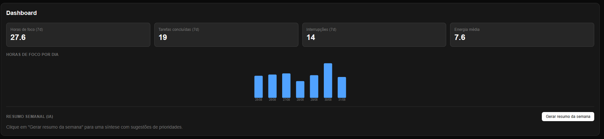

**Histórico de IA**
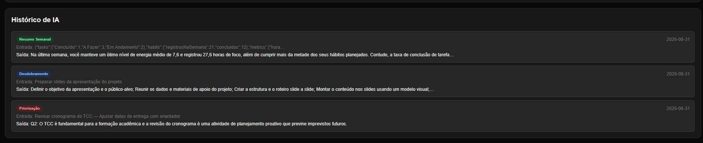

**Responsivo (mobile)**
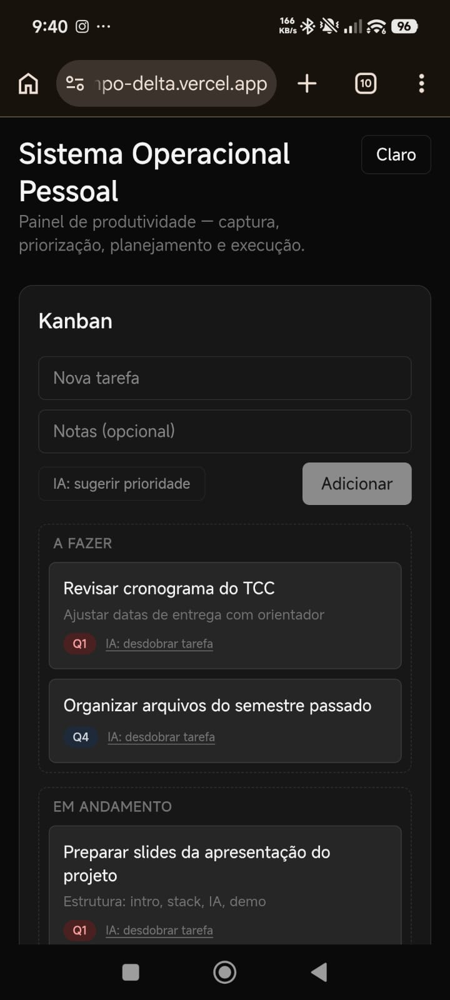

## Melhorias Futuras

O que segue registra, com transparência técnica, o que o sistema ainda não
faz e seria a evolução natural do projeto numa versão pessoal — fora do
escopo desta entrega acadêmica.

- **Autenticação e isolamento por usuário**: hoje o sistema é single-user,
  sem login. Uma versão multiusuário exigiria autenticação (ex.: Google
  OAuth) e isolamento de dados por usuário em todas as tabelas do Airtable.
- **Sincronização de compromissos com o Google Calendar**: permitir que um
  compromisso criado no painel seja também refletido na agenda do Google do
  usuário.
- **Formulário próprio para métricas diárias**: hoje a tabela `Metrics` é
  alimentada via API, sem uma tela dedicada no painel para o usuário
  registrar o próprio dia.
- **Notificações proativas**: hoje todo o acompanhamento depende do usuário
  abrir o painel; não há lembrete ou alerta enviado pelo sistema.
- **Persistência automática de sessões do Pomodoro**: o timer hoje roda
  inteiramente no estado local do componente, sem gravar a sessão
  concluída em nenhuma tabela. Uma sessão completa deveria alimentar
  automaticamente `Metrics.FocusHours` (ou uma tabela própria de sessões),
  fechando o ciclo entre execução e o dado que o Dashboard exibe.
- **Testes automatizados**: a validação do projeto foi feita por
  requisição direta às rotas (HTTP) e inspeção do HTML renderizado, sem
  ferramenta de automação de navegador disponível no ambiente de
  desenvolvimento usado. Uma suíte de testes de API e, depois, testes E2E
  de interface, é a evolução natural dessa validação manual.
- **Resiliência a descontinuação de modelo de IA**: o projeto já
  enfrentou a descontinuação do modelo `gemini-2.0-flash` originalmente
  especificado, exigindo migração em produção. Fixar o nome do modelo em
  variável de ambiente, com um segundo modelo configurado como fallback
  automático em caso de erro 404, evitaria repetir esse retrabalho.
- **Proteção contra cliques duplicados nas ações de IA**: hoje nada
  impede que um duplo clique em "sugerir prioridade" ou "desdobrar tarefa"
  gere chamadas e registros duplicados em `AIInsights` para o mesmo
  input. Debounce ou desabilitar o botão durante a chamada resolveria.
- **Exportação e backup dos dados**: os dados vivem inteiramente no
  Airtable, um serviço de terceiro, sem rotina de exportação ou backup
  próprio documentada.
